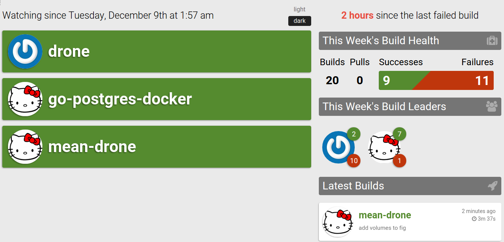

# MEAN.JS with Drone.io

MEAN.JS, Drone.io and Docker

Run tests on each push to master.

* [Run](#run)
* [Develop](#develop)
* [Test Drone](#test-drone)
* [Setup Drone](#setup-drone)

## Run (using docker, daemonized)

    fig up
    open 0.0.0.0:3000

## Develop (using docker)

    ./scripts/dockerize
    ./scripts/start        # run this inside the container
    open 0.0.0.0:3000

## Setup Drone

### Test drone without a drone server

    drone build

### Disable a Project

In the project's setting page (my-drone-server.com/github.com/oren/:project-name/settings) turn off 'Enable Post Commit Hooks'
